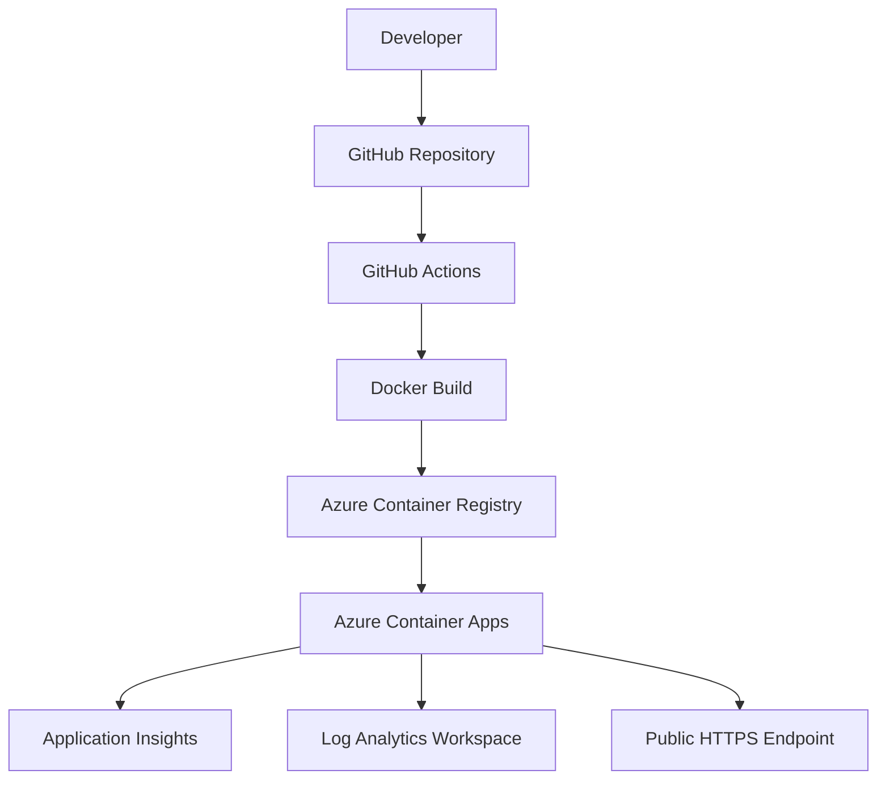
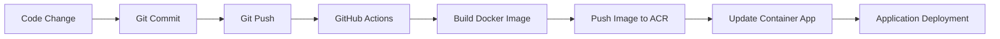

<div align="center">

# 🚀 Azure Container Platform

### End-to-End Azure DevOps Implementation using Terraform, Docker and GitHub Actions

<p align="center">

</p>

<p align="center">


</p>

<p align="center">


</p>

</div>

---

# Project Overview

This repository demonstrates a complete Azure DevOps workflow built using modern cloud-native technologies.

The project provisions Azure infrastructure using Terraform, containerizes a Python Flask application using Docker, stores images in Azure Container Registry, and deploys applications automatically to Azure Container Apps using GitHub Actions.

The objective was not only to deploy an application but also to implement the practices commonly used in real DevOps environments:

* Infrastructure as Code
* CI/CD automation
* Containerized workloads
* Centralized logging
* Application monitoring
* Secure Azure authentication

---

# Architecture



---

# CI/CD Workflow



---

# Azure Resources

| Resource                   | Purpose                       |
| -------------------------- | ----------------------------- |
| Resource Group             | Logical resource organization |
| Azure Container Registry   | Docker image repository       |
| Log Analytics Workspace    | Centralized logging           |
| Application Insights       | Application monitoring        |
| Container Apps Environment | Managed container platform    |
| Azure Container App        | Application hosting           |

---

# Technology Stack

| Category         | Technologies         |
| ---------------- | -------------------- |
| Programming      | Python, Flask        |
| Containerization | Docker               |
| Infrastructure   | Terraform            |
| Cloud Platform   | Microsoft Azure      |
| CI/CD            | GitHub Actions       |
| Monitoring       | Application Insights |
| Logging          | Log Analytics        |
| Source Control   | Git, GitHub          |

---

# Repository Structure

```text
azure-container-platform
│
├── app
│   ├── app.py
│   ├── requirements.txt
│   └── Dockerfile
│
├── terraform
│   ├── main.tf
│   ├── variables.tf
│   ├── outputs.tf
│   └── provider.tf
│
├── architecture
│
├── .github
│   └── workflows
│       └── deploy.yml
│
├── README.md
└── .gitignore
```

---

# Infrastructure Deployment

Infrastructure provisioning is managed entirely through Terraform.

```bash
terraform init

terraform plan

terraform apply
```

Resources are provisioned automatically within Azure.

---

# Container Workflow

Application images are built and stored within Azure Container Registry.

```bash
docker build -t devops-platform:v1 .

docker tag devops-platform:v1 darshanacr001.azurecr.io/devops-platform:v1

docker push darshanacr001.azurecr.io/devops-platform:v1
```

---

# GitHub Actions Pipeline

Every push to the main branch triggers the deployment workflow.

The pipeline performs the following tasks:

* Checkout source code
* Authenticate with Azure
* Build Docker image
* Push image to Azure Container Registry
* Update Azure Container App
* Deploy latest application revision

This enables fully automated application deployments.

---

# Monitoring and Observability

### Application Insights

* Request tracking
* Failure monitoring
* Performance analysis
* Application telemetry

### Log Analytics

* Container logs
* Deployment logs
* Application logs
* Troubleshooting information

---

# Screenshots

## Architecture Diagram


---

## GitHub Actions Pipeline


---

## Azure Resources


---

## Running Application


---

# Why Azure Container Apps?

Azure Container Apps provides a serverless container platform that eliminates the need to manage Kubernetes clusters.

It allows applications to:

* Scale automatically.
* Integrate with Azure monitoring services.
* Deploy directly from container registries.
* Reduce operational complexity.

For small and medium workloads, Container Apps provides a simpler alternative to AKS.

---

# Future Improvements

Planned enhancements include:

* Multi-environment deployments (Dev/UAT/Prod)
* Remote Terraform backend
* Infrastructure pipelines
* AKS implementation
* Blue-Green deployments
* Autoscaling policies
* Custom domains
* SSL certificates

---

# Resume Summary

Built an end-to-end Azure container platform using Terraform, Docker, GitHub Actions, Azure Container Registry, Azure Container Apps, Application Insights, and Log Analytics.

Implemented Infrastructure as Code, CI/CD pipelines, application monitoring, centralized logging, and automated deployments using Microsoft Azure services.

---

# Author

### Darshan Thenge

Cloud Engineer | Azure | Terraform | DevOps

GitHub:
https://github.com/darshanthenge03-cloud

LinkedIn:
(Add your LinkedIn profile)

---

<div align="center">

### If you found this project interesting, please consider giving it a ⭐

</div>


