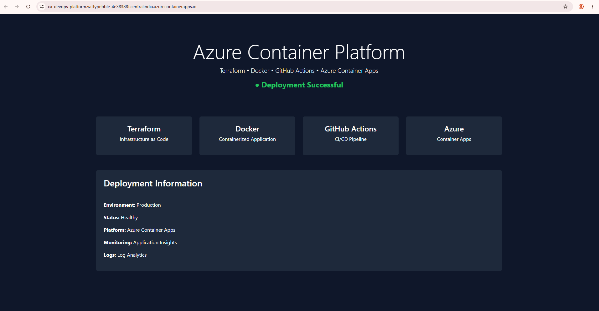

# 🚀 Azure Container Platform using Terraform & GitHub Actions

An end-to-end Azure DevOps project demonstrating Infrastructure as Code, containerization, CI/CD, monitoring, and serverless container deployment on Microsoft Azure.

---

## 📌 Project Overview

This project provisions Azure infrastructure using Terraform, containerizes a Python Flask application using Docker, stores images in Azure Container Registry, and automatically deploys applications to Azure Container Apps using GitHub Actions.

---

## 🏗 Architecture


```text
Developer
    │
    ▼
GitHub Repository
    │
    ▼
GitHub Actions
    │
    ├── Build Docker Image
    ├── Push Image to ACR
    └── Deploy Container App
    │
    ▼
Azure Container Registry
    │
    ▼
Azure Container Apps
    │
    ▼
Application Insights
    │
    ▼
Log Analytics Workspace
```

---

## 🛠 Technologies Used

| Technology               | Purpose                 |
| ------------------------ | ----------------------- |
| Python Flask             | Web Application         |
| Docker                   | Containerization        |
| Terraform                | Infrastructure as Code  |
| GitHub Actions           | CI/CD                   |
| Azure Container Registry | Container Image Storage |
| Azure Container Apps     | Application Hosting     |
| Application Insights     | Application Monitoring  |
| Log Analytics            | Centralized Logging     |
| Azure CLI                | Azure Management        |

---

## 📂 Repository Structure

```text
azure-container-platform
│
├── app
│   ├── app.py
│   ├── requirements.txt
│   └── Dockerfile
│
├── terraform
│   ├── main.tf
│   ├── variables.tf
│   ├── outputs.tf
│   └── provider.tf
│
├── architecture
│
├── .github
│   └── workflows
│
└── README.md
```

---

## ⚙ Infrastructure Components

* Resource Group
* Azure Container Registry
* Log Analytics Workspace
* Application Insights
* Container Apps Environment
* Azure Container App

---

## 🐳 Docker Workflow

```bash
docker build -t devops-platform:v1 .
docker tag devops-platform:v1 darshanacr001.azurecr.io/devops-platform:v1
docker push darshanacr001.azurecr.io/devops-platform:v1
```

---

## ☁ Terraform Deployment

```bash
terraform init
terraform plan
terraform apply
```

---

## 🔄 CI/CD Pipeline

GitHub Actions automatically performs:

* Source Code Checkout
* Azure Authentication
* Docker Build
* Image Push to ACR
* Container App Deployment

---

## 📈 Monitoring

### Application Insights

* Request Monitoring
* Performance Metrics
* Failures
* Response Times

### Log Analytics

* Container Logs
* Application Logs
* Deployment Troubleshooting

---

## 📸 Screenshots

### GitHub Actions


### Azure Resources


### Running Application



---

## 🎯 Key Features

✅ Infrastructure as Code using Terraform

✅ Docker Containerization

✅ CI/CD using GitHub Actions

✅ Serverless Container Deployment

✅ Centralized Logging

✅ Application Monitoring

✅ Automated Azure Deployment

---

## 🚀 Future Enhancements

* Multi-environment deployment (Dev/UAT/Prod)
* Terraform remote backend
* AKS deployment
* Custom domain integration
* Autoscaling policies
* Blue-Green deployment

---

## 👨‍💻 Author

Darshan Thenge

Cloud Engineer | Azure | Terraform | DevOps

GitHub: https://github.com/darshanthenge03-cloud

