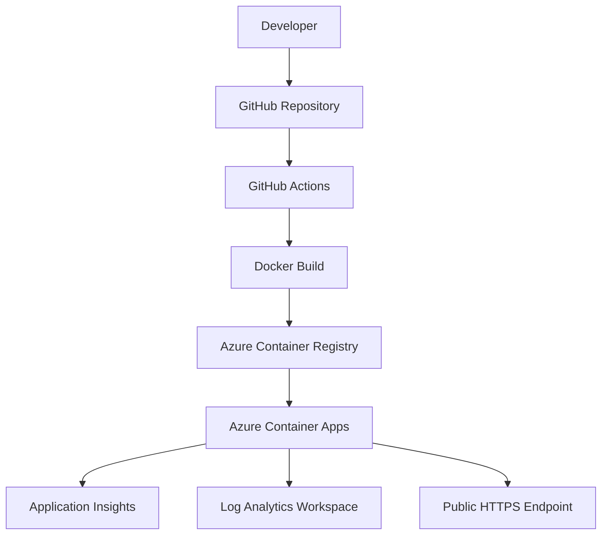
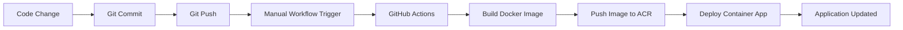
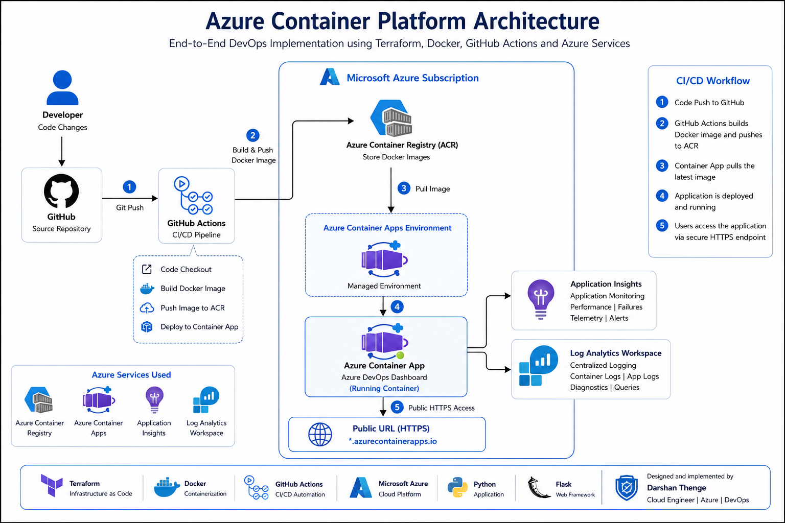
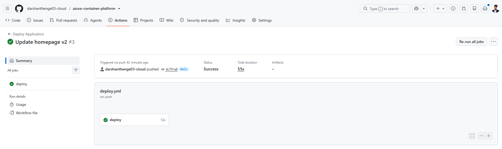
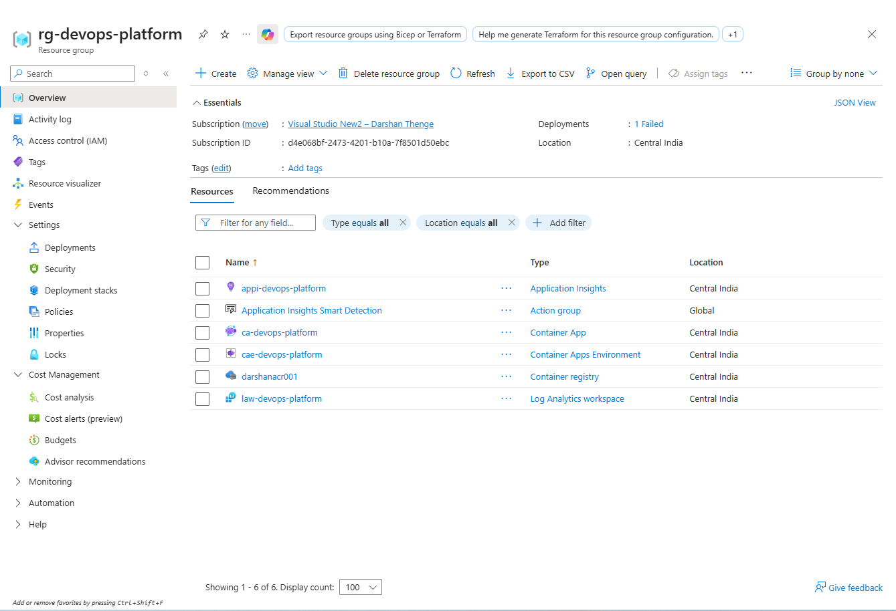

<div align="center">

# 🚀 Azure Container Platform

### End-to-End Azure DevOps Implementation using Terraform, Docker and GitHub Actions

<p align="center">

</p>

<p align="center">


</p>

<p align="center">


</p>

</div>

---

# 📖 Project Overview

This project demonstrates a complete Azure DevOps implementation using modern cloud-native technologies.

The solution provisions Azure infrastructure using Terraform, containerizes a Flask-based web application using Docker, stores images within Azure Container Registry, and deploys applications automatically to Azure Container Apps using GitHub Actions.

The application itself is designed as an Azure DevOps Dashboard that visually represents the deployment platform, cloud architecture, and CI/CD workflow used throughout the project.

---

# 🌐 Application Dashboard

The dashboard provides a visual representation of the cloud platform and deployment architecture.

Features include:

- Responsive Bootstrap UI
- Azure-themed design
- Technology stack overview
- Deployment information
- Environment status
- Monitoring integration details
- Health endpoint
- Containerized deployment

---

# 🏗 Architecture



---

# 🔄 CI/CD Workflow



---

# ☁ Azure Resources

| Resource | Purpose |
|---------|----------|
| Resource Group | Resource Organization |
| Azure Container Registry | Docker Image Storage |
| Log Analytics Workspace | Centralized Logging |
| Application Insights | Application Monitoring |
| Container Apps Environment | Managed Runtime |
| Azure Container App | Application Hosting |

---

# 🛠 Technology Stack

| Category | Technologies |
|---------|-------------|
| Programming | Python, Flask |
| Frontend | HTML, Bootstrap |
| Containerization | Docker |
| Infrastructure | Terraform |
| Cloud Platform | Microsoft Azure |
| CI/CD | GitHub Actions |
| Monitoring | Application Insights |
| Logging | Log Analytics |
| Version Control | Git, GitHub |

---

# 📂 Repository Structure

```text
azure-container-platform
│
├── app
│   ├── app.py
│   ├── Dockerfile
│   ├── requirements.txt
│   └── templates
│       └── index.html
│
├── terraform
│   ├── main.tf
│   ├── variables.tf
│   ├── outputs.tf
│   └── provider.tf
│
├── architecture
│
├── .github
│   └── workflows
│       └── deploy.yml
│
├── README.md
└── .gitignore
```

---

# ⚙ Infrastructure Deployment

Infrastructure provisioning is managed using Terraform.

```bash
terraform init

terraform plan

terraform apply
```

Resources are automatically provisioned within Azure.

---

# 🐳 Application Containerization

The Flask dashboard is containerized using Docker and stored within Azure Container Registry.

```bash
docker build -t devops-platform:v1 .

docker tag devops-platform:v1 darshanacr001.azurecr.io/devops-platform:v1

docker push darshanacr001.azurecr.io/devops-platform:v1
```

---

# 🚀 Deployment Process

The deployment workflow performs the following operations:

- Checkout source code
- Authenticate with Azure
- Build Docker image
- Push image to Azure Container Registry
- Deploy latest container image
- Update Azure Container App

The workflow is currently executed manually through GitHub Actions.

---

# 📈 Monitoring and Observability

### Application Insights

- Request Monitoring
- Performance Analysis
- Exception Tracking
- Application Telemetry

### Log Analytics

- Container Logs
- Deployment Logs
- Application Logs
- Troubleshooting Information

---

# 📸 Screenshots

## Azure DevOps Dashboard


---

## Architecture Diagram



---

## GitHub Actions Pipeline



---

## Azure Resources



---

# 🎯 Project Objectives

This project was created to gain practical experience with:

- Infrastructure as Code
- Containerized applications
- CI/CD implementation
- Azure cloud services
- Application monitoring
- Deployment automation
- DevOps workflows

---

# 🚀 Future Enhancements

Planned improvements include:

- Multi-environment deployments
- Remote Terraform backend
- AKS deployment
- Blue-Green deployment strategy
- Autoscaling rules
- Custom domains
- SSL certificates
- Environment approvals

---

# 💼 Project Outcome

This project demonstrates the implementation of an end-to-end Azure DevOps workflow using modern cloud-native services.

The solution combines Infrastructure as Code, containerization, CI/CD automation, application monitoring, and managed container hosting on Microsoft Azure.

The project was built to gain practical experience with real-world DevOps workflows and Azure platform services.

---

# 👨‍💻 Author

### Darshan Thenge

Cloud Engineer | Azure | Terraform | DevOps

GitHub:

https://github.com/darshanthenge03-cloud

LinkedIn:

https://www.linkedin.com/in/darshan-thenge-933394121/

---

<div align="center">
### ⭐ If you found this project interesting, please consider giving it a star.
</div>

